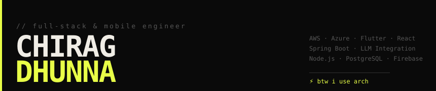

  

 

  

    

  
  
  
  
  
  

---

## About

Full-Stack Software Engineer with **1+ years** building enterprise-scale cloud and mobile applications.
Currently at **Tata Consultancy Services** — shipping AI chatbot platforms on AWS & Azure, serving 10,000+ concurrent users.
Previously at **BlueMango Labs** — Flutter mobile apps, LiveKit real-time infrastructure, Fastlane CI/CD automation.

> Ask me anything about **Flutter · Firebase · AWS · LLM integration · mobile architecture**

---

## Experience

**🏢 Full Stack Developer — Tata Consultancy Services** &nbsp;`2025 – Present` 
`AWS` `Azure` `React` `Java` `Spring Boot` `OAuth2` `LLM/AI`

- Enterprise conversational AI platform scaled to **10,000+ concurrent users** at 99.9% uptime
- Real-time React chatbot interfaces → **+30% end-user engagement** across 3 production clients
- Spring Boot microservices + OAuth2 → **−25% API response latency**
- LLM/prompt-engineering pipelines across 3 enterprise systems → **−40% manual operational workload**

 

**📱 Software Development Engineer — BlueMango Labs** &nbsp;`Jul – Dec 2024` 
`Flutter` `Dart` `LiveKit` `Fastlane` `iOS` `Android`

- Fastlane build automation → **50% shorter release cycles**, eliminated manual QA handoffs
- Flutter i18n for 5 languages → expanded into **3 new international markets**
- LiveKit SDK integration → **−35% connection failures**, live streaming at <500ms for 1,000+ viewers

 

**🚀 SDE Intern — BlueMango Labs** &nbsp;`Jan – Jun 2024` 
`Flutter` `Firebase` `REST APIs` `A/B Testing`

- Redesigned SuperAstro & Kosmic apps (4-round A/B testing) → **+25% usability score**
- Firebase Cloud Messaging push notifications → **+20% DAU within 30 days**
- REST + message broker integration → **2× peak-hour traffic capacity**

---

## Skills

**Languages** 

**Frameworks & Mobile** 

**Cloud & Data** 

**DevOps & Tools** 

---

## Featured Project

### 💰 [Montra — Personal Finance Tracker](https://github.com/chiragdhunna)

`Flutter` `Node.js` `PostgreSQL` `Express.js` `SQLite` `BLoC` `JWT`

Cross-platform finance tracker with budget planning, multi-account support, and CSV analytics exports.

⚡ **< 200ms** avg API response &nbsp;·&nbsp; 🗂️ **10+ categories** with real-time dashboard &nbsp;·&nbsp; ⏱️ Saves **~3 hrs/week/user** 
🔐 JWT + RBAC auth &nbsp;·&nbsp; 📴 SQLite offline-first + BLoC state management

---

## GitHub Stats

  
  

  

---

## Education

🎓 **BE Computer Science** — RGPV University &nbsp;|&nbsp; **GPA: 8.7 / 10.0** &nbsp;|&nbsp; June 2020 – May 2024

---

  
    
  ⚡ btw i use arch

